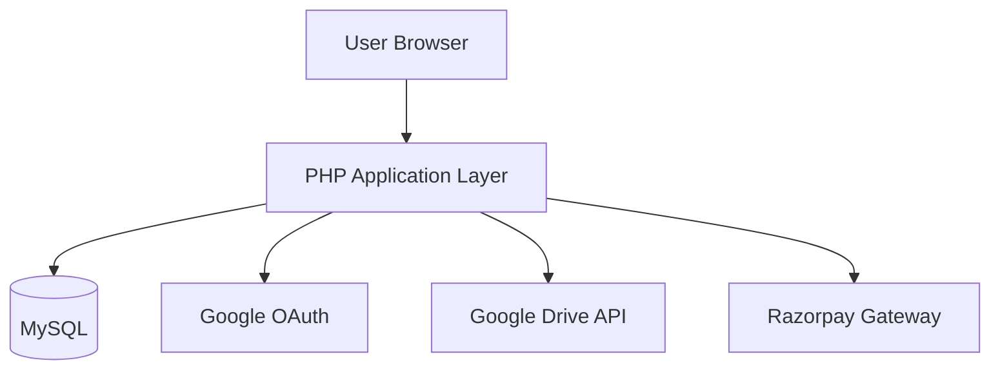
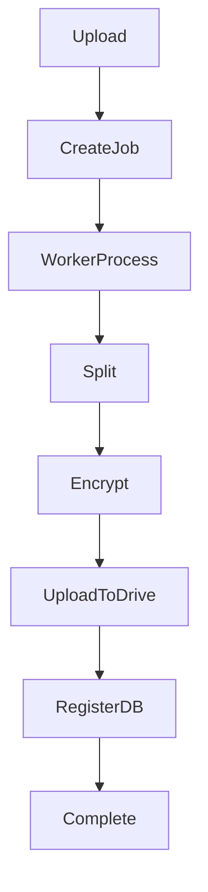
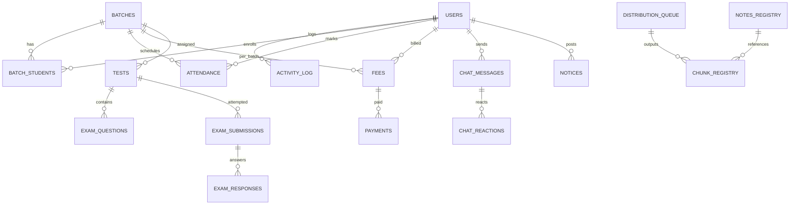
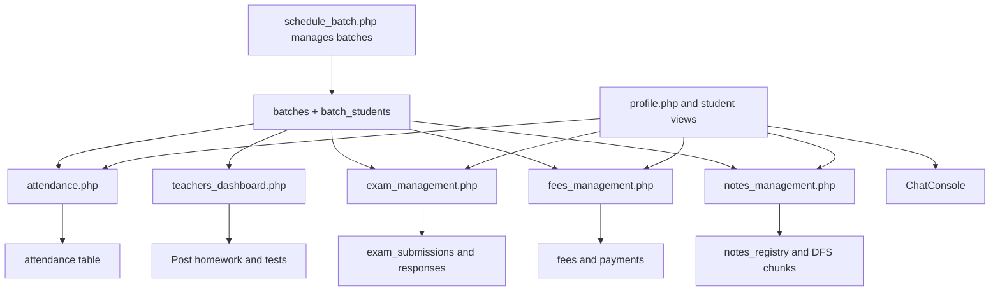
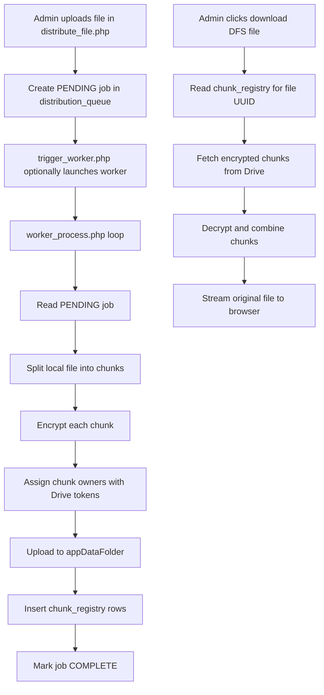

---

# 🎓 ClassCrew- Digital Coaching DFS Platform


> A Secure, Distributed, Cloud-Integrated Learning Management System with Encrypted File Storage.

---

## 🚀 Overview

The **Digital Coaching DFS Platform** is a modular, role-driven digital coaching ecosystem designed for institutes and academic organizations. It integrates attendance tracking, exam management, fee processing, encrypted communication, and a distributed file system powered by Google Drive.

Built with scalable and secure architecture principles, the system ensures:

* Cloud-backed distributed storage
* Role-based dashboards
* Asynchronous background processing
* Secure OAuth authentication
* Real-time academic workflows

---

# ✨ Core Capabilities

### 🔐 Role-Based Access

* Admin Dashboard
* Teacher Dashboard
* Student Portal
* Concurrent session restriction

### 📍 Smart Attendance

* GPS validation
* Batch scheduling
* Calendar-based tracking

### 💳 Fee & Payment System

* Batch-wise fee configuration
* Razorpay integration
* Payment status tracking

### 📝 Exam Engine

* Timed assessments
* MCQ + coding questions
* Submission analytics
* Result tracking

### 💬 Encrypted Communication

* Secure chat console
* Reactions
* Drive-based media sharing
* Cached image proxy

### 📂 Distributed File System (DFS)

* File chunking
* AES encryption
* Google Drive storage
* Background worker processing
* Secure reassembly on download

### 📢 Notices & Notes

* Global announcements
* Batch-scoped distribution
* DFS-backed file attachments

---

# 🗂 Project Structure

```text
project-root/
├─ admin_dashboard.php
├─ attendance.php
├─ authenticate.php
├─ chat_console.php
├─ composer.json
├─ db_config.php
├─ distribute_file.php
├─ drive_manager.php
├─ exam_management.php
├─ fees_management.php
├─ google_callback.php
├─ index.php
├─ notes_management.php
├─ notice_post.php
├─ profile.php
├─ schedule_batch.php
├─ teachers_dashboard.php
├─ worker_process.php
├─ User.class.php
│
├─ vendor/
├─ cache/
└─ temp_uploads/
```

---

# 🏗 System Architecture



### Architecture Principles

* Thin frontend, strong backend logic
* Centralized business abstraction via `User.class.php`
* Encrypted distributed storage
* Asynchronous worker-based processing
* Strict role validation

---

# 🔄 Distributed File Workflow



### DFS Highlights

* Files split into encrypted chunks
* Each chunk stored in Google Drive `appDataFolder`
* Metadata stored in `chunk_registry`
* Secure reassembly via streaming endpoint

---

# 🗄 Database Design Snapshot



---

# 🗄Learning and Teaching Flow


The main teaching loop connects batches, attendance, homework, exams, notes, and communication. Each day, these modules coordinate around batch definitions and membership.

---

---

# 📝DFS Upload, Distribution, and Download


Admins use the DFS console to upload files and later retrieve them. A worker process handles the heavy work asynchronously, using Google Drive for chunk storage.

---

# 🔒 Security Design

* AES-based chunk encryption
* OAuth 2.0 secure login
* Google Drive token isolation
* Role-based query enforcement
* Secure file streaming
* Session concurrency protection

---

# ⚙ Background Worker Engine

The DFS system runs through:

* `worker_process.php` (CLI processor)
* `trigger_worker.php` (non-blocking launcher)
* Windows `start_worker.bat`

This ensures:

* Non-blocking uploads
* Queue-based execution
* Fault tolerance
* Scalable processing

---

# 🧩 Technology Stack

| Layer        | Technology            |
| ------------ | --------------------- |
| Backend      | PHP 8.x               |
| Database     | MySQL                 |
| Auth         | Google OAuth 2.0      |
| Storage      | Google Drive API      |
| Payments     | Razorpay              |
| Async Engine | CLI Worker            |
| Frontend     | HTML, CSS, JavaScript |

---

# 📈 Design Strengths

* Modular architecture
* Distributed encrypted storage
* Clean role separation
* Background job engine
* Cloud-native integration
* Scalable database schema

---

# 🏁 Final Summary

The Digital Coaching DFS Platform represents a **secure, distributed, cloud-powered academic management system** designed with enterprise-level architecture principles.

It combines:

✔ Learning management
✔ Secure communication
✔ Payment automation
✔ Distributed encrypted storage
✔ Modular scalability

---
