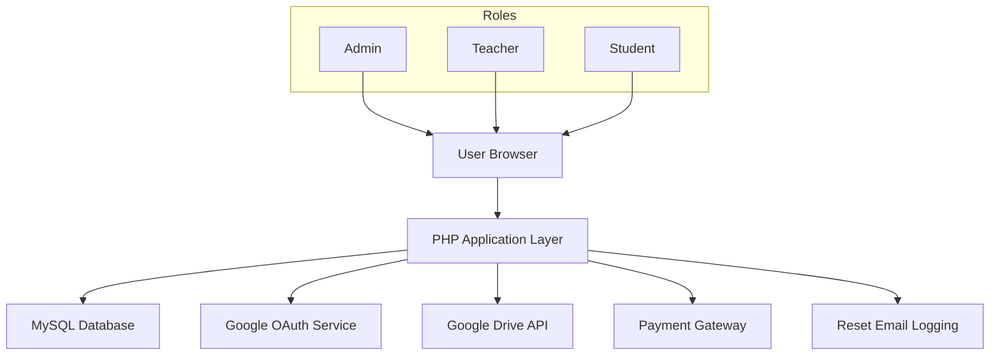
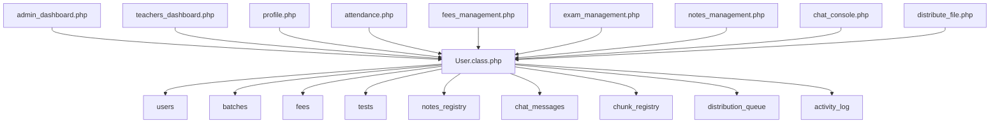
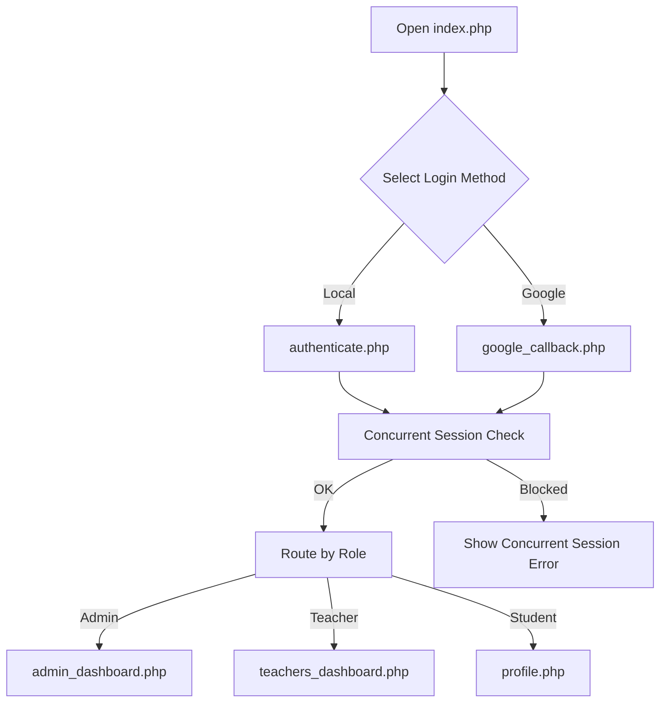
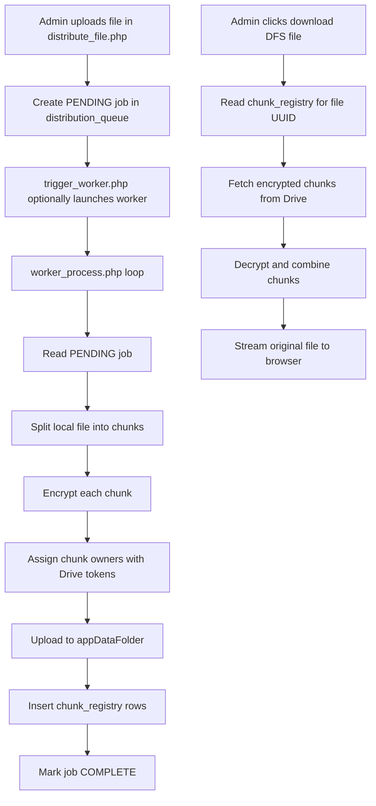
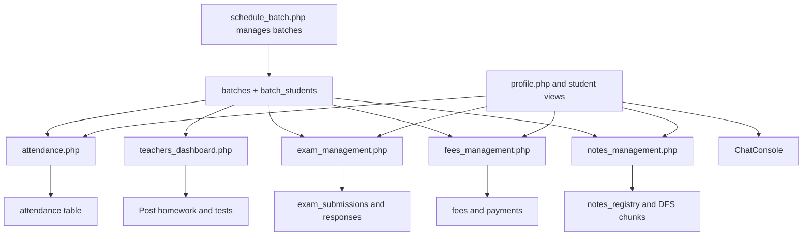
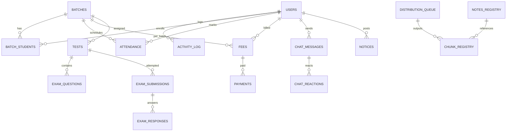

# Digital Coaching DFS Platform

This repository implements a digital coaching platform with integrated attendance, exams, fees, chat, notices, and a distributed file system (DFS). It uses PHP, MySQL, Google OAuth, and Google Drive for secure storage and authentication.

---

## Features

- Role-based dashboards for admins, teachers, and students.
- GPS-based attendance with batch schedules and calendars.
- Batch-wise fees and online payments via Razorpay.
- Exam engine with timed tests, coding questions, and analytics.
- Encrypted chat with reactions and Google Drive media sharing.
- Distributed file storage using encrypted chunks on user Drives.
- Global notices and batch-scoped notes distribution.

---

## Directory Structure

The structure below shows the main files and how they group by responsibility.

```text
project-root/
├─ admin_dashboard.php        # Admin control panel and app launcher
├─ attendance.php             # GPS attendance for students and staff
├─ authenticate.php           # Local email/password login handler
├─ chat_console.php           # Full-screen encrypted chat UI and AJAX API
├─ composer.json              # PHP dependency definitions
├─ composer.lock              # Locked versions of dependencies
├─ db_config.php              # Database and Google OAuth configuration
├─ distribute_file.php        # DFS management console and job dashboard
├─ drive_actions.php          # CRUD actions for Google Drive files
├─ drive_manager.php          # User Google Drive file browser
├─ exam_management.php        # Exam creation, attempt, and analytics
├─ fees_management.php        # Fees dashboard for admins and students
├─ get_file.php               # Secure endpoint for DFS file assembly
├─ get_job_status.php         # AJAX endpoint for DFS job status polling
├─ google_callback.php        # Google OAuth login callback
├─ image_proxy.php            # Cached image proxy for Drive images
├─ index.php                  # Main login page (local and Google)
├─ job_control.php            # Admin actions on DFS jobs
├─ link_google.php            # Start Google Drive linking flow
├─ link_google_callback.php   # Callback for Drive linking
├─ login_system_db.sql        # Database schema and sample data
├─ logout.php                 # Log out and clear sessions
├─ notes_management.php       # Batch notes distribution and retrieval
├─ notice_post.php            # Admin notice creation and management
├─ profile.php                # Student profile and mini app launcher
├─ reset_password.php         # Email-based password reset flow
├─ schedule_batch.php         # Batch scheduler and enrollment manager
├─ send_message.php           # Chat API (simpler interface)
├─ set_password.php           # First-time local password setup
├─ teachers_dashboard.php     # Teacher-focused batch and attendance view
├─ theme_config.php           # Shared theme variables and base CSS
├─ trigger_worker.php         # Non-blocking DFS worker launcher
├─ upload_image.php           # Standalone image upload to Drive
├─ assemble_file.php          # DFS file assembler and download endpoint
├─ start_worker.bat           # Windows loop script for DFS worker
├─ worker_process.php         # CLI DFS job processor
├─ User.class.php             # Core data access and helper class
│
├─ vendor/                    # Composer-installed PHP dependencies
│   └─ ...                    # Google API client, Guzzle, etc.
│
├─ cache/
│   └─ chat_images/           # Cached Drive images for proxy
│
└─ temp_uploads/              # Temporary DFS upload storage (created at runtime)
```

---

## High-Level System Architecture

The application links browser clients, the PHP app, the database, Google APIs, and external gateways. It centralizes business logic in PHP endpoints and the `User` class.



---

## Module-Level Architecture

Each major business area is implemented in one or more entry PHP files, backed by shared tables and utilities. The diagram shows how main modules connect through the `User` class and the database.



---

## User Flows Overview

### Authentication and Role Routing

Users authenticate and get routed to the correct dashboard, depending on their roles and linked Google account. Concurrent session protection prevents multiple active sessions per account.



---

### DFS Upload, Distribution, and Download

Admins use the DFS console to upload files and later retrieve them. A worker process handles the heavy work asynchronously, using Google Drive for chunk storage.



---

### Learning and Teaching Flow

The main teaching loop connects batches, attendance, homework, exams, notes, and communication. Each day, these modules coordinate around batch definitions and membership.



---

## Data Storage Architecture

The database organizes information around users, batches, and activities. Chunks and job queues implement the DFS layer, while standard tables hold educational data.



---

## Summary

This README describes how directories, modules, and subsystems fit together in the digital coaching DFS platform. It highlights the main user flows, data relationships, and integration points, without diving into specific implementation details.
